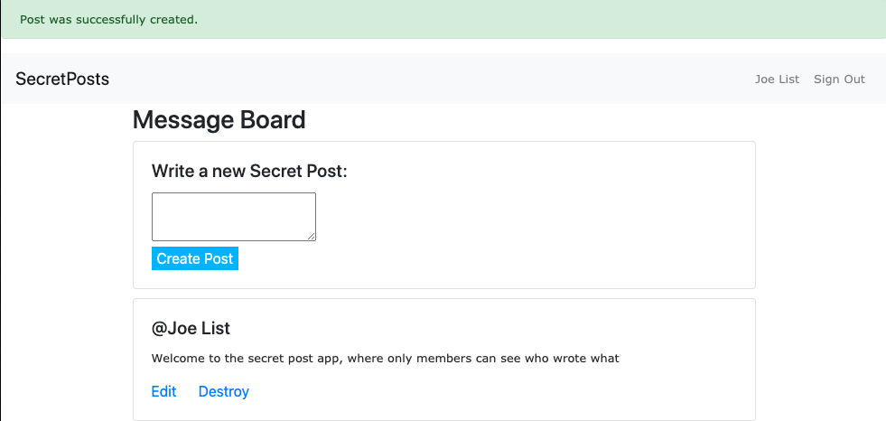

# SecretPosts Rails Application

​

> A small rails application built to practice user authentication.
> ​
> 
> ​
>
> ## Built With
>
> ​
>
> -   Ruby
> -   Ruby on Rails
> -   VS Code \* Atom
>     ​
>     ## Getting Started
>     ​
>     To get a local copy up and running follow these simple example steps.
>     ​
>     ### Prerequisites
>     ​
>
> 1.  Ruby 2.7
> 2.  Rails 6
>     ​
>     ### Setup
>     ​
> 3.  Clone this repository with
>     `git clone https://github.com/defoebrand/members-only.git` using your terminal or command line.
> 4.  Change to the project directory by entering `cd members-only` in the terminal
> 5.  Next run `bundle install` to install the necessary dependencies
> 6.  Run `rails db:migrate` to setup your local database.
> 7.  Finally run `rails server` to start the application.
>     ​
>     ## Authors
>     ​
>     👤 **Mark Rode**
>     ​
>
> -   Github: [@m15e](https://github.com/m15e)
>      
>         ​
>        👤 **Brandon Defoe**
>         ​
>
> -   Github: [@defoebrand](https://github.com/defoebrand)
> -   LinkedIn: [@defoebrand](https://www.linkedin.com/in/defoebrand/)
> -   Gmail: <mailto:defoe.brand@gmail.com>
>     ​
>     ## Show your support
>     ​
>     Give a ⭐️ if you like this project!
>     ​
>     ## Acknowledgments
>     ​
> -   The Odin Project
> -   Microverse
>     ​
>     ## License
>     ​
>     This project is [MIT](lic.url) licensed.
